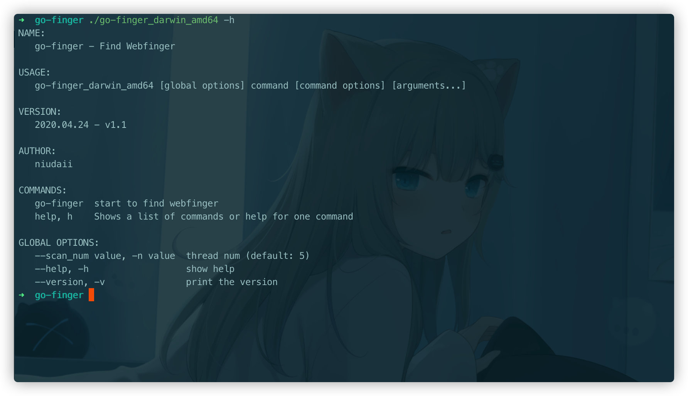

# go-finger

### 声明

仅限用于技术研究和获得正式授权的测试活动。

### 项目说明

个人认为在 POC 直接验证不如先获取web指纹，再确定漏洞路径是否存在，最后再验证 POC。

指纹识别比较有名的是云悉，可惜只支持在线查询并且无法批量。除此之外就是 github 上一些开源项目，Ehole、Glass、TideFinger等等，但是因为不同项目使用的指纹库格式不同，我为了方便整合就用 go 开发了这个项目，其中web指纹规则格式参考EHole，提取了参考链接中的部分指纹。

最初只花了 2 天开发，后来也没有进行大量的规则命中率测试，指纹库还有很大优化空间。

最后，及时增加自己的规则才是王道！

### 使用介绍



- 规则（rules.json）

```json
		{
        "cms": "seeyon",
        "method": "keyword",
        "location": "body",
        "keyword": [
            "/seeyon/USER-DATA/IMAGES/LOGIN/login.gif",
            "/seeyon/common/"
        ]
    }
```

location 分两种情况，body 和 header，分别代表返回包的 body 和 header

其中 body 又分两种情况，faviconhash 和 keyword，faviconhash即 body 中存在 favicon 的话就进行faviconhash 匹配，keyword 就是关键词匹配。

- 并发数

启动时我们需要控制的唯一参数就是并发数，`-n`指定即可，不指定的话默认为 5。

- 输入文件

固定输入文件名为：input.txt，每一行的格式为url（不加默认为 http://，个人建议先 httpx 跑一遍确定协议+存活）

- 输出文件

固定输出文件名为：output.txt

### 使用演示

```
./go-finger_darwin_amd64 go-finger
./go-finger_darwin_amd64 go-finger -n 10
```


### 后续计划

- [ ] 定期更新规则，主要是一些最新cms漏洞的指纹
- [ ] 和 crawlergo 等主动爬虫联动，获取更多的 url 进行识别
- [x] 增加一个关键词num统计命中数量，并根据命中数量进行排序
- [ ] 增加 ssl cert 关键词匹配


### 更新记录

2021.04.20

- 第一版

2021.04.25

- 对 2021hw 漏洞中的 cms 指纹进行更新优化

2021.04.30

- 增加一个关键词num统计命中数量，并根据命中数量进行降序排列

### 参考链接

https://github.com/ShiHuang-ESec/EHole

https://github.com/s7ckTeam/Glass

https://github.com/TideSec/TideFinger

https://github.com/boy-hack/goWhatweb

https://github.com/Becivells/iconhash

---

喜欢的话给个Star吧，希望你不要不识抬举🐶